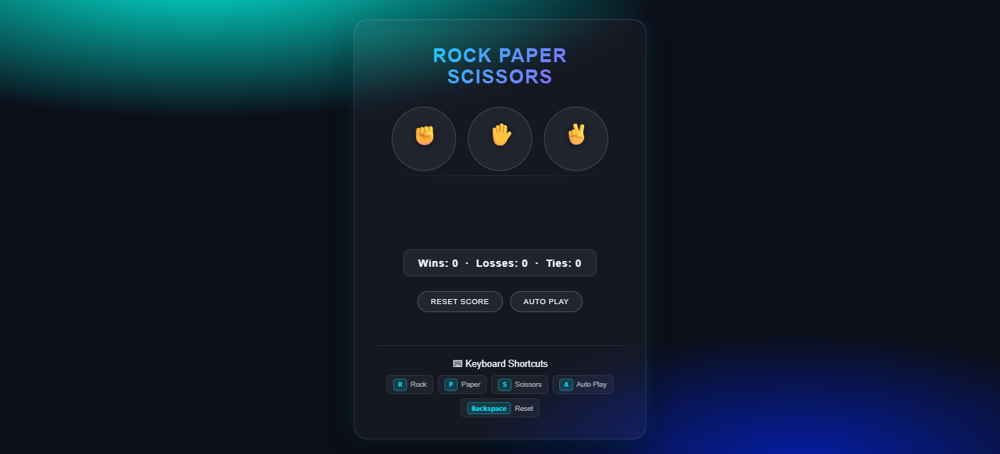
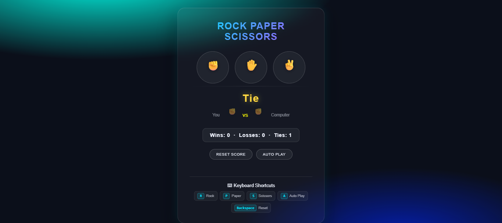
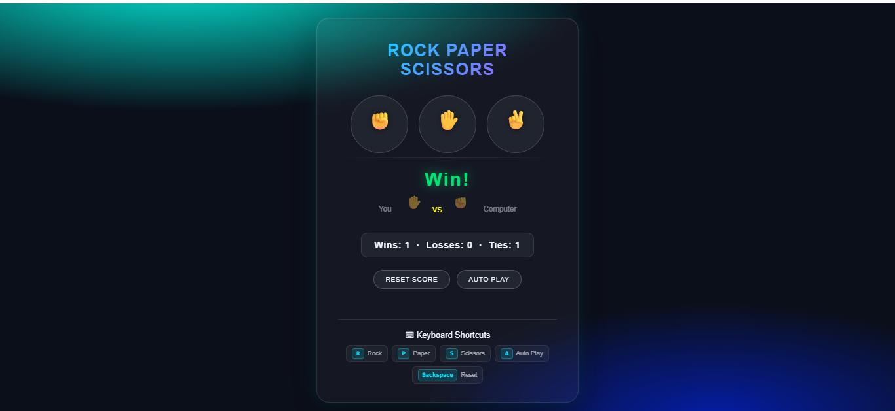
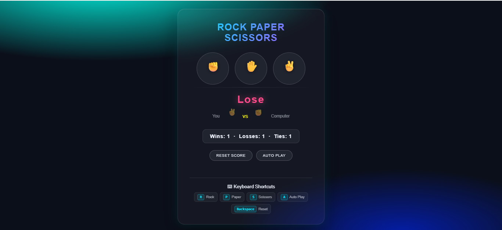

# 🎮 Rock Paper Scissors Game

A modern and interactive Rock Paper Scissors game built using HTML, CSS, and JavaScript.

The project features a futuristic glassmorphism UI, keyboard controls, auto-play functionality, responsive design, and local storage support for score persistence.

---

## 🚀 Features

* ✊ Rock, ✋ Paper, ✌️ Scissors gameplay
* 🎨 Modern glassmorphism UI design
* ⌨️ Keyboard shortcuts support
* 🤖 Auto Play mode
* 💾 Score persistence using localStorage
* 📱 Fully responsive design
* ⚡ Smooth animations and transitions
* ♿ Accessibility improvements

---

## 🛠️ Technologies Used

* HTML5
* CSS3
* JavaScript (ES6)

---

## ⌨️ Keyboard Shortcuts

| Key       | Action           |
| --------- | ---------------- |
| R         | Play Rock        |
| P         | Play Paper       |
| S         | Play Scissors    |
| A         | Toggle Auto Play |
| Backspace | Reset Score      |

---

## 📸 Screenshots

### Main Game UI

*Add your screenshots here*

```md

```

### Gameplay

```md




```

---

## 🌐 Live Demo

Live Demo Link Coming Soon...

---

## 📂 Project Structure

```bash
rock-paper-scissors-game/
│
├── index.html
├── rps.css
├── rps.js
├── README.md
└── screenshots/
```

---

## 🧪 Lighthouse Scores

| Category       | Score |
| -------------- | ----- |
| Performance    | 100   |
| Accessibility  | 96    |
| Best Practices | 100   |
| SEO            | 90    |

---

## 📦 Installation

Clone the repository:

```bash
git clone https://github.com/your-username/rock-paper-scissors-game.git
```

Open the project folder:

```bash
cd rock-paper-scissors-game
```

Run using VS Code Live Server or any local server.

---

## 📈 Future Improvements

* Add sound effects
* Add multiplayer mode
* Add difficulty levels
* Add game statistics dashboard
* Add dark/light theme toggle

---

## 👨‍💻 Author

Balaji M

* MCA Student
* Aspiring Full-Stack Developer

---

## ⭐ Support

If you liked this project, consider giving it a star on GitHub.
